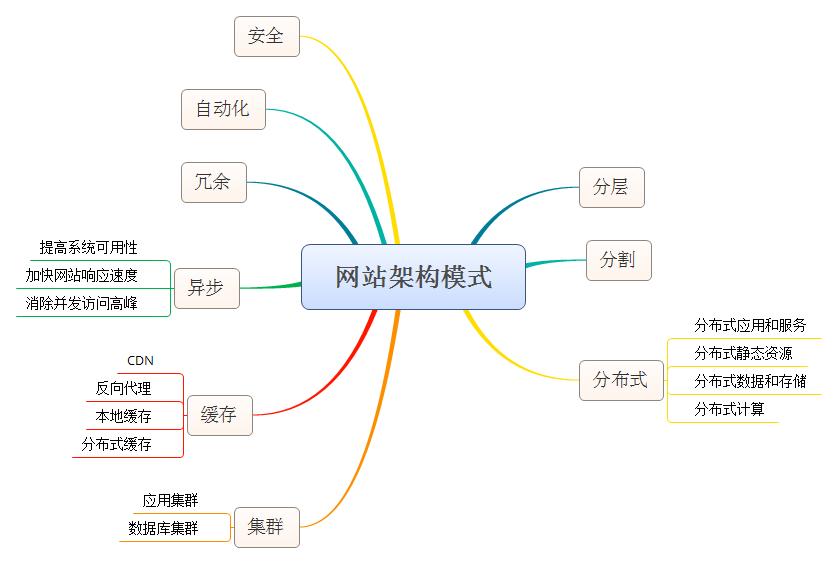

* content
{:toc}

## 搭建站点

昨天，在慕课网上学习了课程[版本控制入门-搬进Github](http://www.imooc.com/learn/390)，开始学习如何使用GitHub。

今天了解到用GitHubpages可以搭建自己的站点，就想着能不能搭建一个自己的博客，忙活了大半天终于搭建好了，虽然也只是Fork别人的项目，但是心里还是感觉美滋滋。然后简单的学习了一下[Markdown的语法](http://wowubuntu.com/markdown/basic.html)，就跑来写第一篇博客了。

这里要感谢博客主题的提供者[gaohaoyang](https://github.com/Gaohaoyang)。

***

## 定个小目标

接下来的目标就是把之前所学的前端的知识梳理一遍，都放进自己的博客里面，不仅对之前的知识算是一个复习，页能够与看到我的博客的那些前端初学者们共勉。

***


## Markdown语法测试

**标题**

### 三级标题

***

**区块引用**

> 区块引用内容

***

**强调内容**

段落中**需要强调的内容**和*斜体内容*等等。

***

**无序列表**

- 无序列表项1
- 无序列表项2
- 无序列表项3
- 无序列表项4

***

**有序列表**

1. 有无序列表项1
2. 有无序列表项2
3. 有无序列表项3
4. 有无序列表项4

***

**项目中插入多项内容**

- 无序列表
	内容区域1
	内容区域2
	> 无序列表内的区块引用
	
- 无序列表
	内容区域1
	内容区域2
	> 无序列表内的区块引用
	
***

**链接**

[我的博客](https://logan70.github.io/)

***

**带title的链接**

[我的博客](https://logan70.github.io/ "This is my blog")

***

**图片**



***

**代码**

`<p>这是一个段落</p>`

	<p>这是一个段落</p>

***

**代码块**

```html
	<!DOCTYPE HTML>
	<html>
	<head>
		<meta http-equiv="Content-Type" content="text/html; charset=utf-8">
		<title>下拉菜单</title>
	</head>
	<body> 
	</body>
	</html>
```


